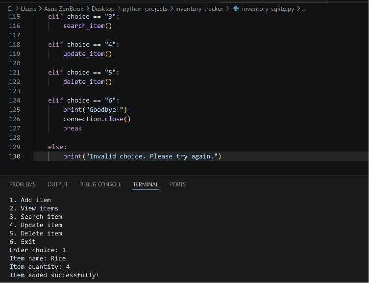
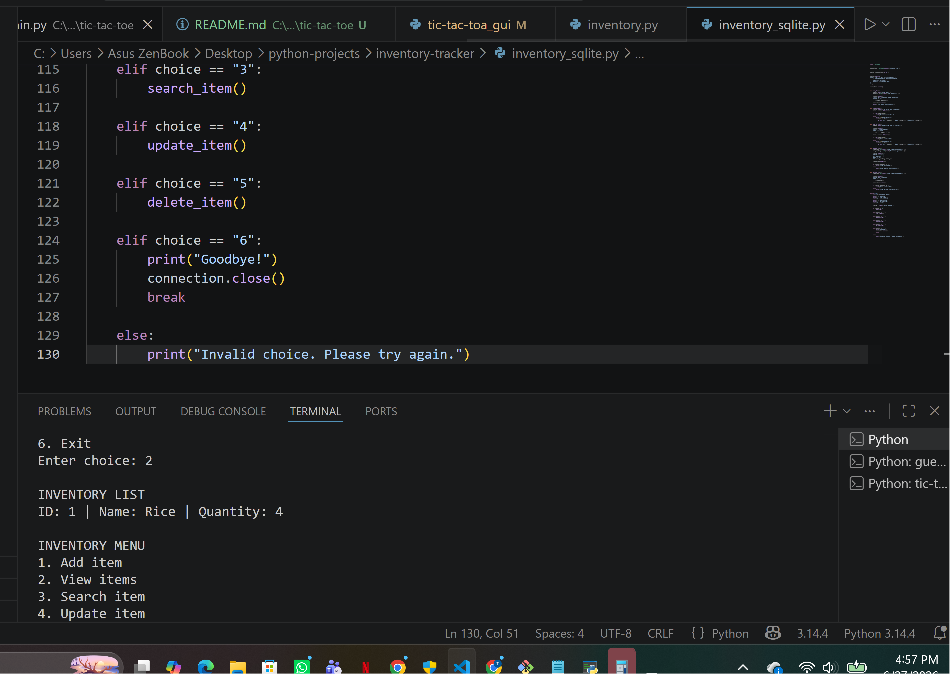

# Inventory Tracker

This is a simple inventory tracker built with Python.  
The project allows users to add inventory items, view stored items, and manage basic stock information.

I also started improving the project by adding an SQLite version so that inventory data can be saved in a database instead of disappearing when the program closes.

## Features

- Add inventory items
- Record item quantities
- View inventory list
- Menu-based command line system
- Basic Python functions
- SQLite version for database storage

## Technologies Used

- Python
- SQLite
- VS Code
- Git and GitHub

## Project Files

- `inventory.py` - basic inventory tracker using a Python list
- `inventory_sqlite.py` - improved version using SQLite database
- `screenshots/` - folder containing project screenshots

## Screenshots

### Main Menu


### Adding an Item



### Viewing Inventory



### SQLite Version


## How to Run

Make sure Python is installed on your computer.

To run the basic version:

```bash
python inventory.py